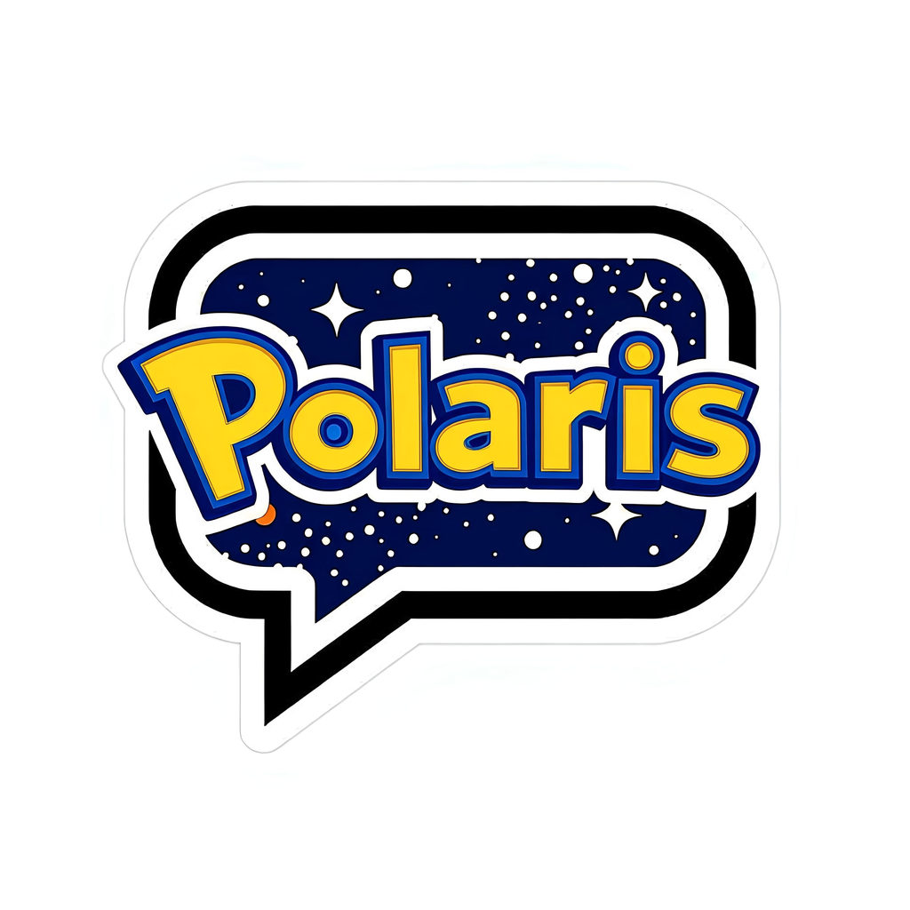
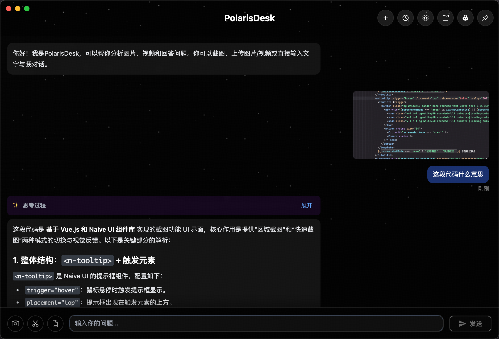
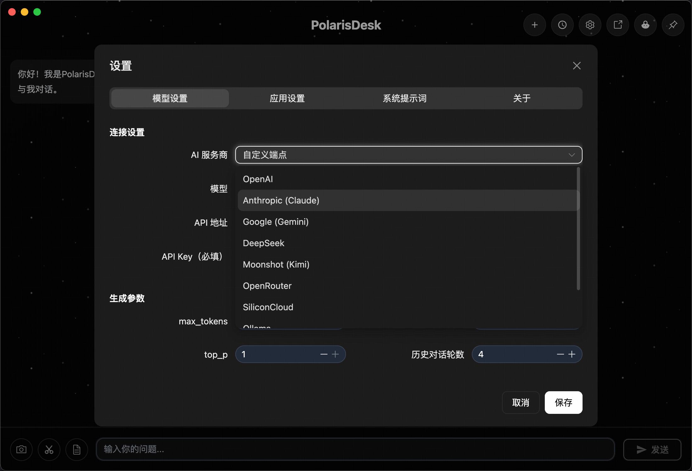

# PolarisDesk

简体中文 | [English](./README.md)

<div align="center">
  
  <p>A Modern AI Desktop Assistant</p>
  <p><em>Like the North Star, guiding your way</em></p>
  
  [](LICENSE)
  [](https://www.electronjs.org/)
  [](https://vuejs.org/)
  [](https://www.typescriptlang.org/)
</div>

## 💫 About PolarisDesk

PolarisDesk, like the North Star guiding sailors, provides intelligent guidance and assistance for your daily work. This is an **AI-powered** desktop assistant application that can be your reliable intelligent partner for document processing, code writing, or problem-solving.

### 🤖 Supported AI Providers

<div align="center">

| OpenAI | Anthropic | Google |
|:------:|:---------:|:------:|
| **DeepSeek** | **Moonshot** | **OpenRouter** |
| **SiliconCloud** | **Ollama** | **Zhipu AI** |

Supports custom endpoints compatible with OpenAI API format

</div>

## 📸 Screenshots

<table>
  <tr>
    <td width="50%">
      <h3 align="center">Main Interface</h3>
      
    </td>
    <td width="50%">
      <h3 align="center">Settings</h3>
      
    </td>
  </tr>
  <tr>
    <td width="50%">
      <h3 align="center">Float Window</h3>
      
    </td>
    <td width="50%">
      <h3 align="center">Demo</h3>
      
    </td>
  </tr>
</table>

## ✨ Features

- 🤖 **AI Chat** - Intelligent conversations with multiple AI models
- 🎨 **Modern UI** - Beautiful interface based on Naive UI
- 💬 **Float Window** - Convenient floating chat window
- 📝 **Markdown Rendering** - Code highlighting, math formulas (KaTeX)
- 📄 **Document Processing** - PDF, PPT parsing support
- 🎬 **Video Compression** - Built-in FFmpeg video processing
- 💾 **Local Storage** - SQLite local database
- ⚡ **Performance Optimized** - Code splitting, lazy loading, virtual scrolling
- 🌐 **Internationalization** - Supports Chinese and English

## 🚀 Quick Start

### Requirements

- Node.js >= 18
- pnpm >= 8

### Installation

```bash
# Clone the repository
git clone https://github.com/t8y2/PolarisDesk.git
cd PolarisDesk

# Install dependencies
pnpm install
```

### Development

```bash
# Start development server
pnpm dev
```

### Build

```bash
# Build application
pnpm build

# Build for Windows
pnpm build:win

# Build for macOS
pnpm build:mac

# Build for Linux
pnpm build:linux
```

## 🛠️ Tech Stack

### Core
- **Electron** - Cross-platform desktop framework
- **Vue 3** - Progressive JavaScript framework
- **TypeScript** - Type-safe JavaScript superset
- **Vite** - Next-generation frontend build tool

### UI Components
- **Naive UI** - Vue 3 component library
- **UnoCSS** - Instant on-demand atomic CSS engine
- **Vue Virtual Scroller** - Virtual scrolling optimization

### Features
- **Markdown-it** - Markdown parser
- **Highlight.js** - Code syntax highlighting
- **KaTeX** - Math formula rendering
- **PDF.js** - PDF document rendering
- **Better-SQLite3** - High-performance SQLite database
- **FFmpeg** - Video processing

## 📁 Project Structure

```
PolarisDesk/
├── src/
│   ├── main/           # Electron main process
│   │   ├── modules/    # Feature modules
│   │   ├── services/   # Service layer
│   │   └── utils/      # Utilities
│   ├── preload/        # Preload scripts
│   └── renderer/       # Renderer process (Vue app)
│       ├── components/ # Vue components
│       ├── views/      # Page views
│       ├── stores/     # Pinia state management
│       └── utils/      # Utilities
├── resources/          # App resources
├── build/             # Build config
└── dist/              # Build output
```

## ⚙️ Configuration

Application config files are located in user data directory:

- **Windows**: `%APPDATA%/polaris-desk`
- **macOS**: `~/Library/Application Support/polaris-desk`
- **Linux**: `~/.config/polaris-desk`

## 🤝 Contributing

Contributions, issues, and feature requests are welcome!

1. Fork this repository
2. Create your feature branch (`git checkout -b feature/AmazingFeature`)
3. Commit your changes (`git commit -m 'Add some AmazingFeature'`)
4. Push to the branch (`git push origin feature/AmazingFeature`)
5. Open a Pull Request

## 📝 Development Guidelines

- Use ESLint for code linting
- Use Prettier for code formatting
- Follow TypeScript type specifications
- Run `pnpm lint` and `pnpm typecheck` before committing

## 🚀 Roadmap

| Feature | Description | Status |
|---------|-------------|--------|
| 🤖 AI-Powered CLI | AI understands intent and executes system commands | Planned |
| 🔌 Plugin System | Third-party plugin support | Planned |
| 🌐 Multi-language | Internationalization | ✅ Completed |
| 🎙️ Voice Interaction | Voice input/output | Planned |
| 🎨 Theme Support | More theme extensions | Planned |
| 💡 More | And more | Planned |

Developers are welcome to contribute via PR!

## 📄 License

This project is licensed under the [MIT](LICENSE) License.

## 📮 Contact

- Project Homepage: [https://github.com/t8y2/PolarisDesk](https://github.com/t8y2/PolarisDesk)
- Issue Tracker: [Issues](https://github.com/t8y2/PolarisDesk/issues)

---

<div align="center">
  Made with ❤️ by PolarisDesk
</div>
